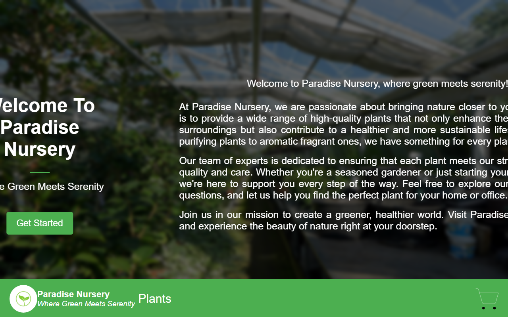

# Paradise Nursery

**A responsive plant shopping web application featuring categorized plant listings and a real-time Redux shopping cart.**

**[Live Demo](https://shalabycode.dev/e-plantShopping/)** · **[Source](https://github.com/Shalabyelectronics/e-plantShopping)**



## About

Paradise Nursery is an e-commerce front-end application built as a front-end development capstone project. It provides plant enthusiasts with a platform to browse indoor greenery, review plant benefits, and manage a cart before checkout. The project highlights state-driven view transitions and centralized cart state management using React and Redux Toolkit.

## Features

- **Categorized Plant Catalog**: Displays indoor plants organized across 5 categories (Air Purifying, Aromatic Fragrant, Insect Repellent, Medicinal, and Low Maintenance) with pricing, descriptions, and imagery.
- **Redux State Management**: Centralizes shopping cart operations in a Redux Toolkit slice, handling item additions, item deletions, and quantity updates.
- **Dynamic Cart Counter**: Navbar cart badge calculates and displays the aggregate quantity of selected plants in real time.
- **Interactive Cart Management**: Dedicated cart screen featuring item quantity increments/decrements, item removals, itemized subtotal calculations, and an automatically calculated total bill.
- **Responsive Styles**: CSS media queries adapt the header, product grid, and cart cards for tablet and mobile widths.

## Built With

- React 18
- Redux Toolkit & React-Redux
- Vite
- CSS3
- GitHub Pages

## What I Learned

- Designing and configuring a Redux Toolkit slice (`createSlice`) with reducers to handle immutable cart state updates.
- Connecting components to global state using `useSelector` and dispatching payload actions with `useDispatch`.
- Deriving dynamic cart totals and product item subtotals using JavaScript array reduction and string parsing.
- Managing conditional views (landing page, product list, shopping cart) through component state without third-party routing.
- Configuring environment-aware base paths in `vite.config.js` to ensure reliable builds and assets on GitHub Pages.

## Getting Started

### Prerequisites
- Node.js (v18 or higher recommended)
- npm

### Installation
```bash
git clone https://github.com/Shalabyelectronics/e-plantShopping.git
cd e-plantShopping
npm install
npm run dev
```

## Project Structure

```text
├── src/
│   ├── AboutUs.jsx         # Mission and nursery introduction component
│   ├── App.jsx             # Root view controller and landing page
│   ├── CartItem.jsx        # Shopping cart view and total cost calculator
│   ├── CartSlice.jsx       # Redux slice for cart actions and state
│   ├── ProductList.jsx     # Plant catalog grid and navbar cart badge
│   ├── main.jsx            # React root with Redux Provider wrapper
│   └── store.js            # Redux store configuration
├── index.html
├── package.json
└── vite.config.js
```

## Roadmap

- [ ] Fix the landing-page hero overflow on wide desktop screens
- [ ] Implement checkout flow with a mock payment confirmation modal
- [ ] Persist cart state to `localStorage` across page refreshes
- [ ] Add category filter buttons and search input to the plant catalog
- [ ] Add unit tests for `CartSlice` reducer actions using Vitest

## Author

Mohamed Shalaby — [Website](https://shalabycode.dev) · [GitHub](https://github.com/Shalabyelectronics) · [LinkedIn](https://www.linkedin.com/in/mhdshalaby/)
